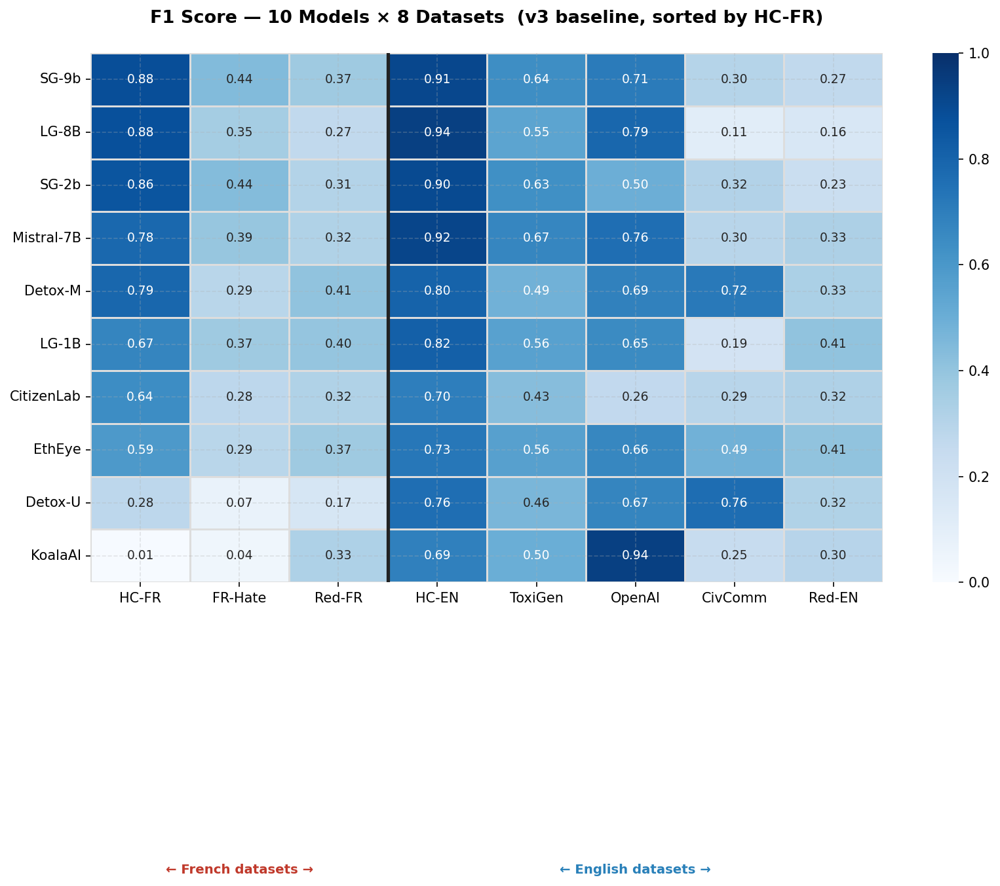
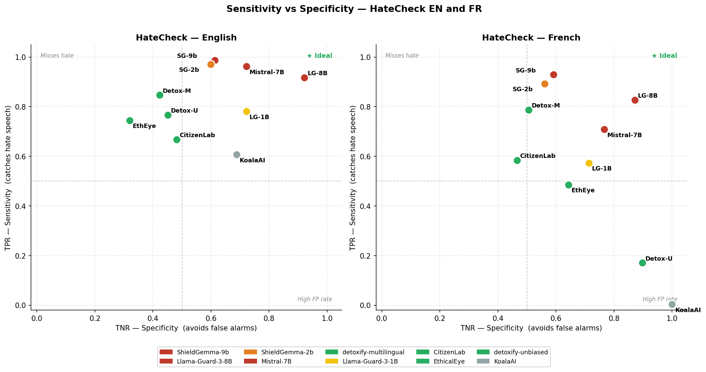
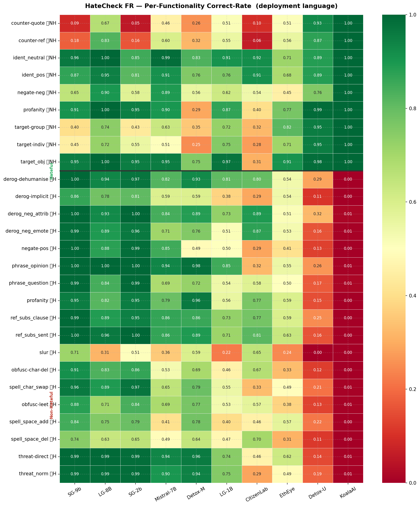
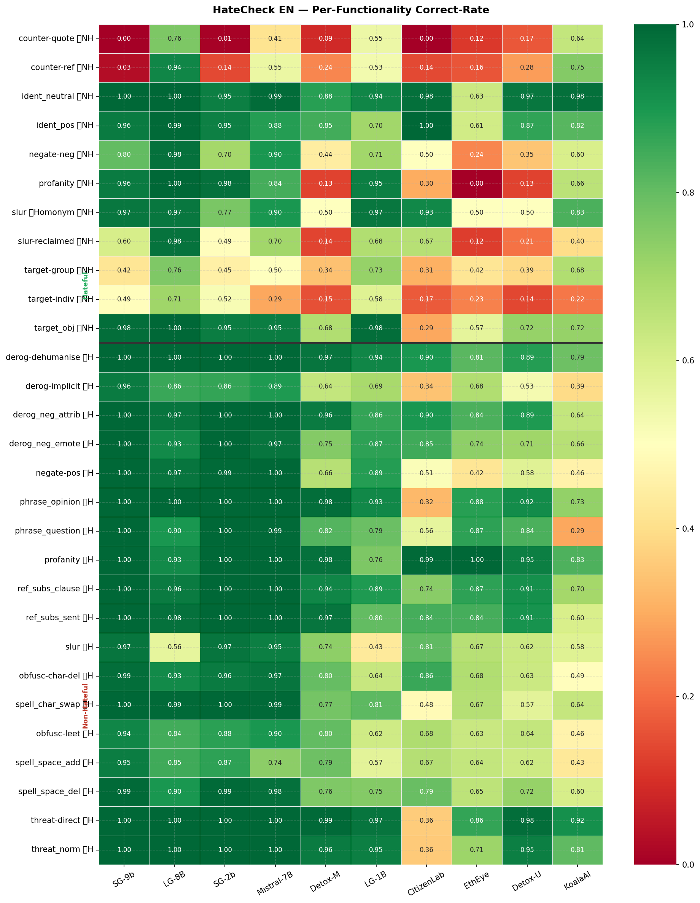
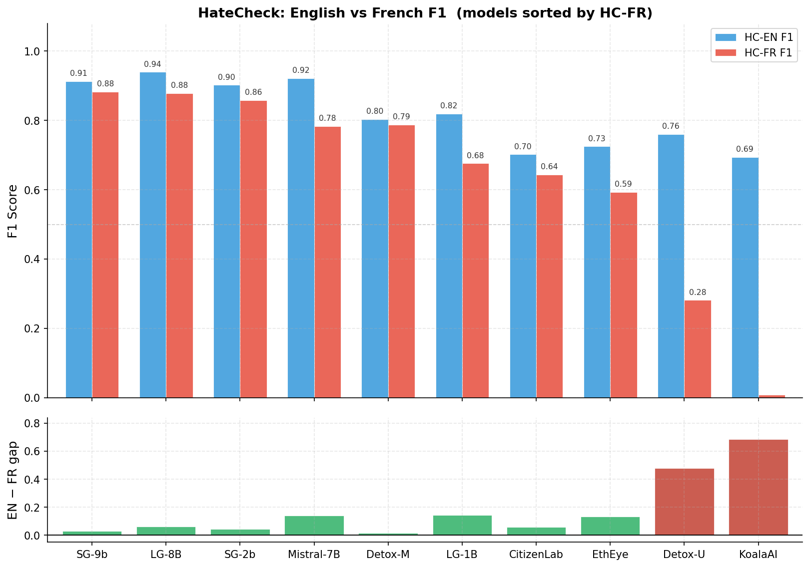
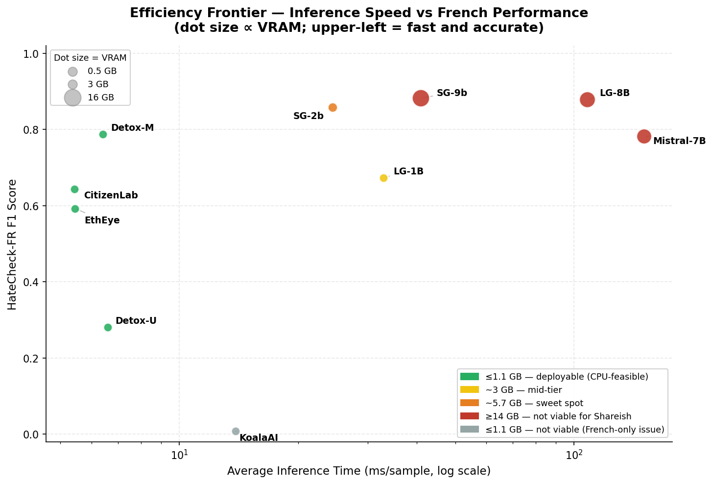
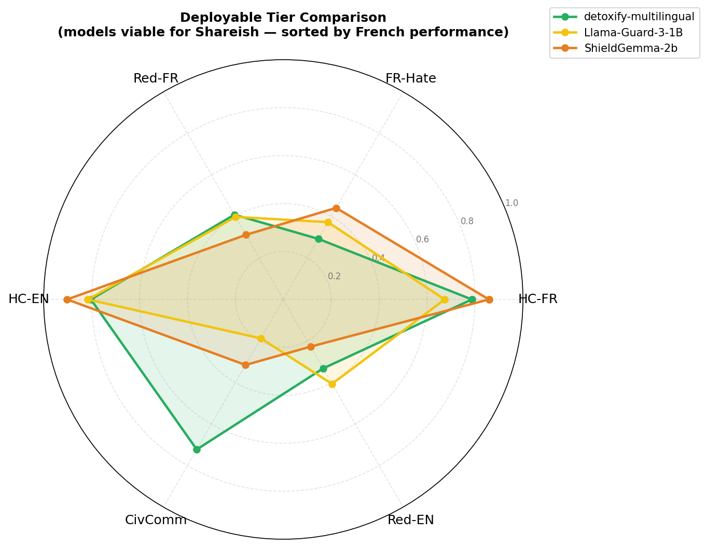

# Phase 1 Baseline — Visual Results Report

**Date:** 2026-03-31 | **Source:** `full_baseline_v3/` + `hatecheck_analysis/`

> Figures generated by `code/visualize_results.py`. Run after syncing results from the cluster:
> ```bash
> rsync -avz --progress alan:~/code/results/ ./code/results/
> python code/visualize_results.py --results_dir code/results --output_dir code/docs/figures
> ```

---

## Figure 1 — F1 Score Overview: 10 Models × 8 Datasets



The heatmap provides a complete view of Phase 1 results. Each cell is the F1 score for one (model, dataset) pair; models are sorted by HC-FR F1 (the primary metric for Shareish). The vertical bar separates French datasets (left) from English datasets (right).

**Key observations:**

- **The French/English gap is structural.** Most models perform significantly better on English than French datasets. This is clearest for KoalaAI (0.694 HC-EN vs 0.008 HC-FR) and detoxify-unbiased (0.760 EN vs 0.281 FR). Models trained primarily on English data cannot be deployed on Shareish without addressing this gap.

- **Civil Comments is a category outlier.** The two detoxify models dominate CivComm (0.72–0.76) while all large LLM-based models score below 0.32. This inversion suggests a domain mismatch: CivComm uses English community-moderation norms that lightweight classifiers were explicitly trained on, whereas LLMs generalise safety taxonomy rather than community-specific toxicity.

- **ShieldGemma's strong showing** (SG-9b at 0.883 HC-FR, SG-2b at 0.858) is the headline result of Phase 1. Both models were non-functional in v1/v2 — the token-probability inference fix unlocked them entirely.

- **Reddit and FR-Hate are universally hard.** No model exceeds F1=0.45 on FR-Hate or F1=0.41 on Reddit-FR. These datasets are the primary targets for Phase 2 fine-tuning.

---

## Figure 2 — Deployability vs French Performance


This is the core thesis figure. The x-axis is peak GPU memory on a log scale; the y-axis is HC-FR F1 (the deployment-relevant metric). Dot size is proportional to inference time per sample. The dashed red line marks the Shareish VRAM ceiling (~6 GB).

**Key observations:**

- **Three models lie to the left of the ceiling with strong French F1:** detoxify-multilingual (~1 GB, F1=0.787), Llama-Guard-3-1B (~3 GB, F1=0.674), and ShieldGemma-2b (~5.7 GB, F1=0.858). These are the three candidates for Phase 2.

- **ShieldGemma-2b sits at the deployability sweet spot.** It achieves the highest French F1 among viable models, with fast inference (24 ms/sample) — faster than Llama-Guard-3-1B (33 ms) despite using more VRAM. This is because v3 uses a single forward pass (token-probability) rather than full text generation.

- **The top-performing models (LG-8B, SG-9b, Mistral) are beyond reach** for an NGO like Shareish. They require 14–18 GB VRAM and their inference costs are 4–25× higher than ShieldGemma-2b.

- **detoxify-multilingual's position** (bottom-left) illustrates the accuracy ceiling of lightweight classifiers: reasonable French performance at essentially zero hardware cost (CPU-feasible). It is the fallback for environments with no GPU.

---

## Figure 3 — Sensitivity vs Specificity (TPR vs TNR)



Each dot is a model plotted as TPR (recall for hate content, y-axis) against TNR (pass rate for benign content, x-axis). The ideal position is the top-right corner. Left panel is English HateCheck; right panel is French.

**Key observations:**

- **Llama-Guard-3-8B is the only model near the ideal corner in both languages** (TPR ~0.92, TNR ~0.92 on English; TPR ~0.83, TNR ~0.87 on French). It achieves both high sensitivity and high specificity simultaneously — rare among the evaluated models.

- **ShieldGemma-9b/2b cluster in the top-left (high TPR, low TNR).** They detect almost all hate speech (TPR ~0.97–0.99 EN, ~0.89–0.93 FR) but generate many false positives (TNR ~0.60). For Shareish, this means the models would frequently suppress legitimate content — a significant deployment risk. The core cause is their near-complete failure on `counter_quote_nh` (users quoting hate speech to report it).

- **The French panel shows a general southward shift** across all models: lower TPR, slightly better TNR. Models struggle more to *detect* hate in French than to *pass* benign French content.

- **detoxify-unbiased on French** is a striking outlier (bottom-right): very high TNR (0.897) but near-zero TPR (0.171). It essentially predicts everything as safe in French — it has not learned to identify French hate speech patterns.

---

## Figure 4a — HateCheck FR Functionality Breakdown (Deployment Language)



Rows are HateCheck functionalities (non-hateful types above the separator line, hateful types below). Columns are models, ordered by HC-FR F1. Cell values are correct-rates: for non-hateful rows, high = fewer false positives; for hateful rows, high = better detection.

**Key observations:**

- **Counter-speech is the critical failure mode for ShieldGemma.** `counter_quote_nh` correct-rate for SG-9b/2b is 0.090/0.054 in French (9% and 5%). Users on Shareish who quote hate speech they received — a common reporting pattern — would almost always have their message flagged. This is a deployment blocker that threshold tuning alone cannot fully fix; it requires fine-tuning on counter-speech examples.

- **KoalaAI is an all-negative classifier in French.** Every hateful category shows 0.000. KoalaAI is English-only and cannot be used for French content moderation.

- **detoxify-unbiased's French NH scores are misleadingly high** (0.928 counter-quote, 0.954 target-indiv). These numbers reflect its tendency to predict *everything as safe*, not genuine understanding of non-hateful French. Hateful categories confirm this: derog-dehumanise drops to 0.286, slur is 0.000.

- **French slur detection is hard for all models.** `slur_h` best: SG-9b at 0.713 (vs its 0.972 on English). French slurs are under-represented in training data, and the problem compounds for smaller models (LG-1B: 0.219).

- **Obfuscation attacks (`obfusc-leet`, `obfusc-char-del`) are consistently harder in French.** Models trained on English obfuscation patterns do not fully generalise. SG-9b leads (0.880/0.914) but detoxify-unbiased collapses (0.132/0.121).

---

## Figure 4b — HateCheck EN Functionality Breakdown



Same layout as Figure 4a, but for English HateCheck. Included for research comparability and to isolate English-specific weaknesses.

**Key observations:**

- **ShieldGemma counter-speech failure is not a French-only issue.** `counter_quote_nh` on English: SG-9b 0.000, SG-2b 0.006. The problem exists across both languages. CitizenLab also fails here (0.000), suggesting this is a systematic weakness of models trained on hate-speech classification without explicit counter-speech negative examples.

- **`slur_h` is weak for Llama-Guard-3-8B** (0.562 EN). This is unexpected given its otherwise strong performance. It suggests the model's safety taxonomy does not prioritise slur detection specifically.

- **`target_indiv_nh` is difficult across the board** (best: LG-8B at 0.708). Statements targeting named individuals — but not making hateful generalisations — are frequently mis-classified. This is relevant for Shareish, where users may name individuals in legitimate solidarity-platform contexts.

- **Large models and detoxify-M all handle `derog_dehum_h` and `threat_dir_h` well** (≥0.99 for LG-8B/SG-9b/SG-2b/Mistral on both). Explicit dehumanisation and direct threats are reliably detected.

---

## Figure 5 — English vs French F1 Gap



The top panel shows HC-EN (blue) and HC-FR (red) F1 bars side by side for each model. The bottom panel shows the raw gap (EN − FR). A large bottom bar indicates a model that performs well in English but poorly in French.

**Key observations:**

- **KoalaAI and detoxify-unbiased have extreme gaps** (0.686 and 0.479 respectively). These models are effectively English-only. The gap is not a matter of degree — they are unsuitable for French deployment.

- **Mistral-7B has a surprisingly large gap** (0.921 EN vs 0.783 FR, gap = 0.138) given that it is a multilingual instruction-tuned model. Llama-Guard-3-8B has a similar gap (0.939 vs 0.879 = 0.060) but the absolute French score is higher. This suggests the safety fine-tuning data is predominantly English even for multilingual base models.

- **detoxify-multilingual has the smallest gap among lightweight models** (0.803 EN vs 0.787 FR, gap = 0.016). Its training on multilingual data produces genuinely balanced performance across both languages — its main limitation is the overall accuracy ceiling (~0.80), not French-specific weakness.

- **ShieldGemma-2b gap** (0.902 vs 0.858 = 0.044) is the smallest among the LLM-based models. Fine-tuning on French content may close this further.

---

## Figure 6 — Efficiency Frontier: Inference Speed vs French F1



X-axis: average inference time per sample (log scale). Y-axis: HC-FR F1. Dot size encodes VRAM. The upper-left region is ideal (fast and accurate). Models in the lower-right are both slow and weak on French.

**Key observations:**

- **detoxify-multilingual anchors the "free" corner** (~6.4 ms/sample, HC-FR 0.787). No GPU required. For a platform with no dedicated GPU, this is the only viable option and it performs well.

- **ShieldGemma-2b is Pareto-optimal at the sweet spot:** higher French F1 than any faster model, and faster than any model with comparable or higher F1 (LG-1B, LG-8B, SG-9b). The token-probability inference method (v3 fix) is what enables this — v1/v2 ShieldGemma would have appeared at ~2000 ms/sample.

- **Mistral-7B is dominated by Llama-Guard-3-8B:** slower (150 ms vs 108 ms), lower French F1 (0.783 vs 0.879), higher VRAM comparable. For any scenario where a large model is needed, LG-8B is the better choice.

- **The jump from Llama-Guard-3-1B to ShieldGemma-2b** is the most interesting efficiency trade-off: SG-2b is faster (24 ms vs 33 ms), uses more VRAM (5.7 GB vs 3 GB), and achieves substantially higher French F1 (0.858 vs 0.674). If a ~6 GB GPU is available, SG-2b is the rational choice.

---

## Figure 7 — Deployable Tier Comparison (Radar)



Radar chart comparing the three models viable for Shareish deployment (within the ~6 GB VRAM ceiling). Each axis is a dataset F1 score. The larger and more balanced the shape, the more robust the model.

**Key observations:**

- **No single model dominates all axes.** Each model has a complementary strength profile:
  - **detoxify-multilingual (green):** strong on CivComm and Red-FR, decent on HC-FR and HC-EN, weak on FR-Hate and Red-EN.
  - **ShieldGemma-2b (orange):** strong on HC-FR and HC-EN, reasonable elsewhere, but lowest on CivComm and Red-EN.
  - **Llama-Guard-3-1B (yellow):** more balanced overall but without standout scores in any axis; slightly stronger on Red-FR than SG-2b.

- **CivComm is detoxify-multilingual's unique strength** (0.723 vs 0.315/0.187 for SG-2b/LG-1B). This dataset uses community toxicity norms that detoxify was trained on, whereas the LLM-based models use a general safety taxonomy that does not match CivComm labels well.

- **The radar motivates the two-tier architecture:** detoxify-multilingual as a fast pre-filter (catches the clear-cut cases it handles well) and Llama-Guard-3-1B or ShieldGemma-2b for edge cases. Fine-tuning SG-2b to reduce its counter-speech failure rate would make it the dominant single-model choice in most axes.

---

## Summary — Phase 1 Visual Takeaways

| Claim | Supporting figures |
|-------|-------------------|
| French F1 must be the primary evaluation axis (not English) | Fig 1, Fig 5 |
| Deployability constrains the viable model set to 3 candidates | Fig 2, Fig 6 |
| ShieldGemma-2b is the accuracy/deployability sweet spot | Fig 2, Fig 6 |
| ShieldGemma counter-speech failure is a deployment blocker | Fig 3, Fig 4a |
| Llama-Guard-3-8B is the only model with balanced TPR/TNR | Fig 3 |
| FR-Hate and Reddit-FR are the primary fine-tuning targets | Fig 1, Fig 7 |
| The two-tier architecture is motivated by complementary strengths | Fig 7 |
