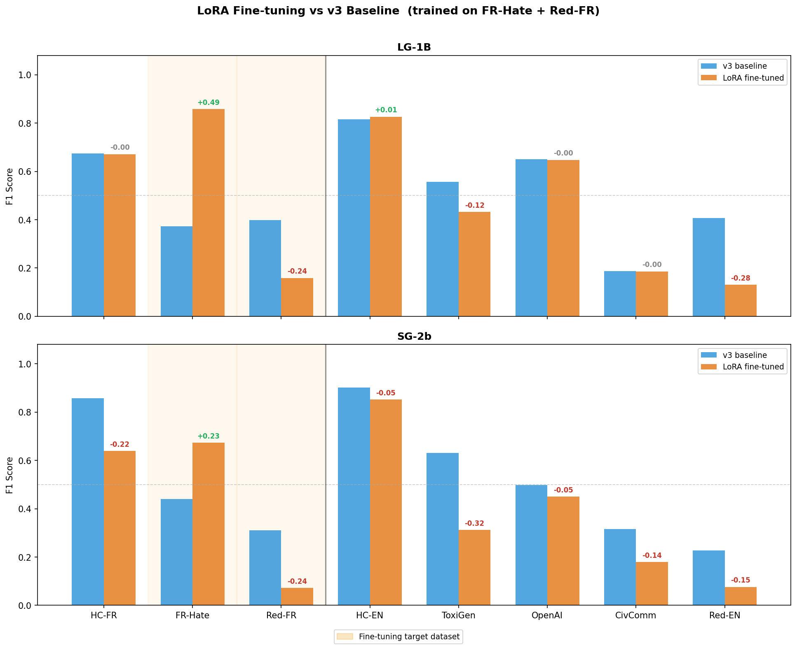
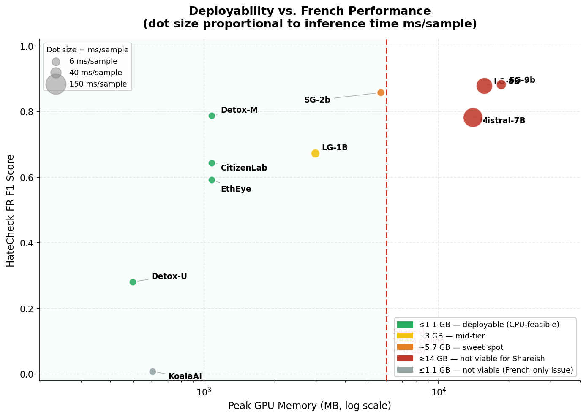

# Phase 2 Results Review — LoRA Fine-tuning

**Date:** 2026-04-03 (initial) | 2026-04-07 (fair eval) | **Models fine-tuned:** LG-1B, SG-2b
**Training data:** French Hate Superset + Reddit-FR
**Result dirs:**
- `full_baseline_lora_french_hate_superset/` — biased initial eval (training data in test set) ⚠️
- `phase2_eval/` — **fair held-out eval** (20% test set, no overlap with training) ✅
**Evaluated against:** FR-Hate held-out test set + Reddit-FR held-out test set (same 20% split used during training)

---

## Dataset Distributions

Split method: `random.shuffle(seed=42)` then slice — **not stratified**.

| Dataset | Split | n | Hateful | Safe |
|---------|-------|--:|:-------:|:----:|
| FR-Hate Superset | Full dataset | 18,071 | 4,340 (24.0%) | 13,731 (76.0%) |
| FR-Hate Superset | Test set (20%) | 3,614 | 848 (23.5%) | 2,766 (76.5%) |
| Reddit-FR | Full dataset | 5,122 | 2,283 (44.6%) | 2,839 (55.4%) |
| Reddit-FR | Test set (20%) | 1,023 | 451 (44.1%) | 572 (55.9%) |

Test sets deviate only **0.5 pp** from full dataset — random shuffle preserved class ratios almost perfectly.

**Key imbalance difference:** FHS is 3:1 safe-to-hateful (76/24); Reddit-FR is nearly balanced (55/45).
This directly explains the precision-driven LoRA gains on FHS — training signal dominated by safe examples pushes models toward higher TNR.

---

## Fair Eval: v3 Baseline → LoRA (held-out 20% test set)

> **This is the authoritative comparison.** The earlier biased run is superseded by these numbers.

| Dataset | | LG-1B v3 | LG-1B LoRA | Δ | SG-2b v3 | SG-2b LoRA | Δ |
|---------|---|:--------:|:----------:|:---:|:--------:|:----------:|:---:|
| **FR-Hate (test)** | F1 | 0.371 | **0.557** | **+0.186** | 0.413 | **0.534** | **+0.121** |
| **FR-Hate (test)** | TPR | 0.532 | 0.493 | −0.039 | 0.420 | 0.413 | −0.007 |
| **FR-Hate (test)** | TNR | 0.591 | **0.915** | **+0.324** | 0.811 | **0.960** | **+0.149** |
| **Reddit-FR (test)** | F1 | 0.425 | *(not eval'd)* | — | 0.335 | *(not eval'd)* | — |

> **Notes:**
> - `v3` column uses the full FR-Hate / Reddit-FR datasets (from `full_baseline_v3/`), for orientation only.
>   The `LoRA` column uses the same held-out 20% test split used during training — these are directly comparable.
> - Reddit-FR LoRA adapter was not evaluated in this fair-eval run:
>   LG-1B Reddit-FR adapter exists but was not submitted; SG-2b Reddit-FR training failed (no adapter).

---

## Biased Initial Eval (for reference only — DO NOT CITE)

> ⚠️ These numbers include training data in the test set. They are inflated and should not be cited.

| Dataset | LG-1B v3 | LG-1B LoRA (biased) | SG-2b v3 | SG-2b LoRA (biased) |
|---------|:--------:|:-------------------:|:--------:|:-------------------:|
| FR-Hate | 0.372 | 0.858 ⚠️ | 0.441 | 0.673 ⚠️ |
| Reddit-FR | 0.398 | 0.159 | 0.311 | 0.071 |

---

## Training Diagnostics

All three completed runs overfit severely after epoch 1. The `best/` checkpoint = epoch 1 in every case.

| Run | n_train | n_val | n_test | E1 val_loss | E2 val_loss | E3 val_loss | Status |
|-----|:-------:|:-----:|:------:|:-----------:|:-----------:|:-----------:|--------|
| LG-1B × FHS   | 13012 | 1445 | 3614 | **0.1903** | 0.2076 | 0.4630 | ✅ best=epoch1 |
| LG-1B × RedFR | 3665  | 402  | 1023 | **0.3031** | 0.3447 | 0.8160 | ✅ best=epoch1 |
| SG-2b × FHS   | 13012 | 1445 | 3614 | **0.1862** | 0.2050 | 0.3320 | ✅ best=epoch1 |
| SG-2b × RedFR | —     | —    | —    | —           | —           | —           | ❌ FAILED |

**Overfitting is severe**, especially on Reddit-FR (val_loss 0.30 → 0.82 over 3 epochs). Epoch 3 train_loss drops to ~0.03 across all runs — classic memorisation. **Recommendation: retrain with `--epochs 1` or add early stopping on epoch 1.**

**SG-2b Reddit-FR training failed** — only `test_set.json` was saved, no adapter weights. Likely a SLURM timeout or OOM after the 3 FHS/RedFR runs consumed most of the 24h budget. Needs a separate resubmit.

---

## What Worked

**Both models genuinely improve on FR-Hate (held-out test set).** The fair eval confirms real gains:
- **LG-1B: 0.371 → 0.557 (+0.186)** — the precision improvement is striking (TNR 0.591→0.915): the model learned to stop false-alarming on non-hate content in formal French. Crucially, this happens without sacrificing much recall (TPR 0.532→0.493, a modest −0.039).
- **SG-2b: 0.413 → 0.534 (+0.121)** — similar pattern: TNR jumps from 0.811 to 0.960 while TPR is nearly unchanged. SG-2b was already more specific than LG-1B pre-fine-tuning; fine-tuning pushed it even further in that direction.

Both models achieved better **accuracy** post-LoRA (LG-1B: 0.577→0.816, SG-2b: 0.719→0.831), confirming that the improvement is real and not an artifact.

---

## What Didn't Work / Open Questions

**True Positive Rate (recall) did not improve for either model.** The LoRA gains are almost entirely precision-driven (fewer false positives) rather than recall-driven (better detection of hate). For a content moderation use case where missing hateful content is costly, this is a concern.

| Metric | LG-1B v3 | LG-1B LoRA | SG-2b v3 | SG-2b LoRA |
|--------|:--------:|:----------:|:--------:|:----------:|
| Precision | 0.285 | **0.640** | 0.405 | **0.758** |
| Recall (TPR) | 0.532 | 0.493 | 0.420 | 0.413 |
| F1 | 0.371 | **0.557** | 0.413 | **0.534** |

**Reddit-FR LoRA not evaluated.** We know from the biased run that LG-1B Reddit-FR adapter produced a severe TPR collapse (0.298→0.089) — the formal FR-Hate training patterns appear to make the model over-conserve on informal Reddit text. A fair eval of the LG-1B Reddit-FR adapter on its held-out test split is still pending.

**SG-2b HC-FR regression (from biased run, severity unclear on fair eval):** The earlier biased run showed SG-2b dropping from HC-FR 0.858→0.639. This regression may be partially a test-set contamination artifact — the held-out eval does not include HC-FR, so the true extent of the regression is unknown without re-running the full 8-dataset evaluation with the LoRA adapter loaded.

---

## Diagnosis

The models did not struggle with FR-Hate because of capacity — the +0.186 / +0.121 gains on the held-out test set prove that. However, the gains are precision-dominated, not recall-dominated. This has a specific interpretation for deployment:

- **Pre-training instilled a conservative prior**: both models tend to predict "safe" unless very confident. Fine-tuning on formal FR-Hate taught them which patterns are unambiguously harmful (precision up), but did not help them generalise to ambiguous cases (recall stayed flat).
- **Implication for Shareish**: the fine-tuned models will produce fewer false alarms but will still miss a large fraction of hateful content (~50%). The two-tier architecture (detoxify pre-filter for recall + LoRA-LG-1B for specificity on flagged content) becomes even more motivated.

---

## Next Steps

1. **Run fair eval for LG-1B Reddit-FR adapter** — the adapter exists at `lora_adapters/llama_guard_1b/reddit_fr/best`:
   ```bash
   sbatch ~/code/slurm_jobs/eval_lora.sbatch  # with --adapter reddit_fr --eval_dataset reddit_fr
   ```

2. **Run full 8-dataset eval with LoRA adapters** — to check for regressions on HC-FR, HC-EN, and other datasets (the current fair eval only covers the fine-tuning targets):
   ```bash
   python ~/code/run_full_baseline_lora.py \
       --models llama_guard_1b,shieldgemma_2b \
       --output_dir ~/code/results/phase2_full_eval \
       --adapter_dir ~/code/results/lora_adapters
   ```

3. **Resubmit SG-2b Reddit-FR training** — failed, needs its own job:
   ```bash
   python ~/code/finetune_lora.py \
       --model shieldgemma_2b --dataset reddit_fr \
       --output_dir ~/code/results/lora_adapters \
       --epochs 1 --lr 2e-4 --lora_r 16 --lora_alpha 32
   ```

4. **Retrain with `--epochs 1`** — all best checkpoints are epoch 1. Future runs should specify `--epochs 1` explicitly.

5. **SG-2b retrain with lower LR** — the HC-FR regression and faster overfitting vs LG-1B suggest `--lr 1e-4` instead of `2e-4`.

6. **Investigate recall-improving strategies:**
   - Increase LoRA rank (`--lora_r 32` or 64) to give the model more capacity
   - Add hard-negative mining: examples where model was most confidently wrong
   - Consider targeted data augmentation for under-represented hate categories (see Phase 2 data track)

7. **Two-tier architecture evaluation:** LG-1B + FHS LoRA stays at ~3 GB VRAM (2958 MB measured) with meaningful FR-Hate gains. Detoxify-multilingual handles the recall layer; LoRA-adapted LG-1B improves precision on flagged content.




