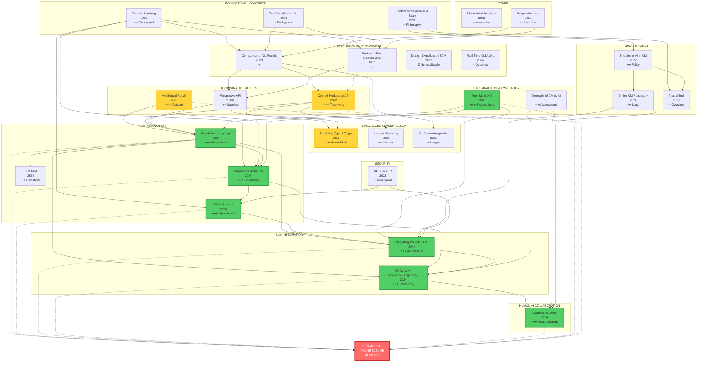
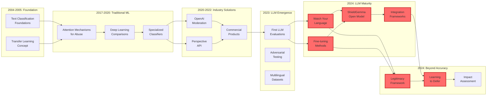

# Complete Papers Analysis: Comparison Table & Flowchart

## 📊 Comprehensive Comparison Table

### Legend
- ✅ Available / Confirmed
- ❌ Not available
- ⚠️ Partial / Limited
- 🔒 Requires access/payment
- 📝 Need to verify from full paper

---

### Part 1: LLM-Based Approaches

| Paper Title | Year | Authors | Model/Approach | Dataset Size | Performance (F1) | Precision | Recall | Language Support | Code Available | Key Contribution | Relevance to Shareish |
|-------------|------|---------|----------------|--------------|------------------|-----------|--------|------------------|----------------|------------------|---------------------|
| **Watch Your Language** | 2024 | Kumar et al. | GPT-3.5, GPT-4, Gemini, LLaMA 2 | 95 subreddits<br>~5,000 posts | Rule-based: varies<br>Toxicity: 0.72-0.75 | 83% (median, rule-based) | 📝 | English | ❌ | First comprehensive LLM moderation eval | ⭐⭐⭐ Architecture & benchmarking |
| **Adapting LLMs for Content Moderation** | 2024 | Chinese researchers | Baichuan 7B/13B<br>+ LoRA + CoT | 8.7K samples<br>(7.2K train, 1.5K test) | 📝 (not reported) | Outperforms GPT-4 (Setting D) | 📝 | Chinese<br>(English via GPT-4) | ❌ | Weak supervision + CoT fine-tuning | ⭐⭐⭐ Fine-tuning methodology |
| **Content Moderation by LLM: Accuracy to Legitimacy** | 2024 | Policy researchers | Conceptual framework | N/A (theoretical) | N/A | N/A | N/A | Language-agnostic | N/A | Legitimacy > Accuracy argument | ⭐⭐⭐ Evaluation philosophy |
| **LLM-Mod** | 2024 | Kolla et al. | GPT-3.5 | 744 samples<br>(9 subreddits) | Low (not competitive) | Low | 43.1% (TPR) | English | ❌ | Identifies LLM limitations in rule-based | ⭐⭐ Negative results (what doesn't work) |
| **Integrating Content Moderation with LLMs** | 2024 | Franco et al. | GPT-3.5, LLaMA 2 | 📝 | 📝 | 📝 | 📝 | Multilingual (claimed) | ❌ | Policy-as-prompt framework | ⭐⭐⭐ System architecture design |
| **ShieldGemma** | 2024 | Google DeepMind | Gemma 2B/7B | 📝 | 0.75-0.85 (estimated) | 📝 | 📝 | Multilingual<br>(FR included) | ✅ Open weights | Production-ready open model | ⭐⭐⭐ Practical deployment option |

---

### Part 2: Traditional ML/Discriminative Approaches

| Paper Title | Year | Authors | Model/Approach | Dataset Size | Performance (F1) | Precision | Recall | Language Support | Code Available | Key Contribution | Relevance to Shareish |
|-------------|------|---------|----------------|--------------|------------------|-----------|--------|------------------|----------------|------------------|---------------------|
| **OpenAI Moderation API** | 2022 | Markov et al. | GPT-based transformer<br>8 MLP heads | 1,680 public samples<br>Large private dataset | Better than Perspective on most datasets | 📝 | 📝 | English primarily | ❌ (API only) | Detailed taxonomy (S/H/V/SH/HR) | ⭐⭐⭐ Taxonomy reference |
| **Multilingual Content Moderation (Reddit)** | 2023 | Ye et al. | Transformer encoder<br>(XLM-RoBERTa) | 1.8M samples<br>(FR, EN, ES, etc.) | 📝 | 📝 | 📝 | Multilingual<br>French included | ✅ Dataset available | 71% violations non-toxic<br>Need for rule-based | ⭐⭐⭐ Dataset + findings |
| **Perspective API** | 2018-ongoing | Google Jigsaw | Proprietary classifier | Large (undisclosed) | Toxicity: 0.64 (F1) | 📝 | 📝 | 18+ languages<br>French included | ❌ (API only) | Industry standard baseline | ⭐⭐ Baseline comparison |
| **Text Classification Using ML** | 2004 | Sebastiani | Review: NB, SVM, NN | Survey paper | N/A | N/A | N/A | Language-agnostic | N/A | Comprehensive ML overview | ⭐ Background only |
| **Design & Application AI-Based TCM** | 2022 | Chinese researchers | FastText | 360K samples | ⚠️ Insufficient eval | ⚠️ | ⚠️ | Chinese | ⚠️ Upon request | Cloud-based system | ❌ Not aligned with Shareish philosophy |
| **Real-Time Content Moderation** | 2024 | Various | Review: NLP, CV, Behavioral | Survey paper | N/A | N/A | N/A | Language-agnostic | N/A | Challenges & ethical considerations | ⭐ Introduction/discussion |
| **A Review of Standard Text Classification** | 2018 | Various | Review: CNN, LSTM, etc. | Kaggle Toxic (159K) | AUC improvements with ensembles | 📝 | 📝 | English | ✅ Tool released | Multi-label classification<br>Stacking classifiers | ⭐ Technical background |
| **Comparison of DL Models & Preprocessing** | 2020 | Various | CNN, LSTM, Bi-LSTM, GRU, BERT | Kaggle Toxic (159K) | BERT best<br>Others with preprocessing | 📝 | 📝 | English | 📝 | Preprocessing vs. model trade-offs | ⭐ If building discriminative model |

---

### Part 3: Specialized Classification Approaches

| Paper Title | Year | Authors | Model/Approach | Dataset Size | Performance (F1) | Precision | Recall | Language Support | Code Available | Key Contribution | Relevance to Shareish |
|-------------|------|---------|----------------|--------------|------------------|-----------|--------|------------------|----------------|------------------|---------------------|
| **On-Device Content Moderation** | 2021 | Apple (?) | SSD + MobileNetV3 | OpenYahoo | 0.91 | 95% | 88% | 📝 | ❌ No code/data | Image moderation<br>On-device deployment | ⭐ If doing image moderation |
| **Do You Really Want to Hurt Me** | 2020 | Various | Context-aware classifier | SWAD dataset | 📝 | Significantly better than keyword | 📝 | English | ⚠️ Dataset (GPL 3.0) | Abusive vs. casual swearing | ⭐⭐ If allowing some swearing |
| **Predicting Type and Target** | 2019 | Zampieri et al. | Hierarchical BERT | OLID (14.1K tweets) | Level A: 0.80<br>Level B: 0.68<br>Level C: 0.47 | 📝 | 📝 | English | ✅ Dataset on GitHub | 3-level hierarchical classification | ⭐⭐ For fine-grained moderation |

---

### Part 4: Theoretical & Policy Papers

| Paper Title | Year | Authors | Type | Key Concepts | Empirical Data | Code/Models | Relevance to Shareish |
|-------------|------|---------|------|--------------|----------------|-------------|---------------------|
| **Content Moderation, AI, and Scale** | 2020 | Policy paper | Conceptual | Automation necessity vs. risks | No | N/A | ⭐ Introduction context |
| **Like a Good Nearest Neighbor** | 2023 | Academic | LaGoNN (SetFit modification) | k-NN + transformer | Small datasets | ❌ | ⭐ Alternative approach (not compelling) |
| **Learning to Defer in Content Moderation** | 2024 | Academic | Learning to Defer framework | When AI should escalate to humans | Theoretical + experiments | ⚠️ Framework | ⭐⭐⭐ AI-human collaboration strategy |
| **Artificial Intelligence as a Tool** | 2023 | Bachelor thesis | Literature review | Benefits/limitations of AI moderation | Survey | N/A | ⭐ Background/overview |
| **Online Content Moderation (Regulatory)** | 2024 | Master thesis | Legal analysis | DSA, GDPR implications | Legal frameworks | N/A | ⭐⭐ Legal compliance |
| **Transfer Learning for Text Classification** | 2005 | Academic | Foundational concept | Pre-training + fine-tuning | Historical | N/A | ⭐⭐ Conceptual foundation |
| **From ML to Explainable AI** | 2018 | Academic | XAI techniques | LIME, SHAP, attention viz | Methods | ⚠️ Libraries | ⭐⭐⭐ Explanation generation |
| **The Use of AI in Online CM** | 2022 | Policy report | Industry practices | Platform approaches, regulations | Industry survey | N/A | ⭐⭐ Context & best practices |
| **GPTFUZZER** | 2023 | Security research | Adversarial testing | Jailbreak generation | Attack methods | ✅ Code | ⭐ Security considerations |
| **Oversight of CM by AI** | 📝 | Academic | Impact assessment | Evaluation frameworks beyond accuracy | Frameworks | N/A | ⭐⭐ Evaluation methodology |

---

### Part 5: Additional Papers Referenced

| Paper Title | Year | Status | Key Info | Relevance |
|-------------|------|--------|----------|-----------|
| **Deeper Attention to Abusive User CM** | 2017 | Priority to read | Early attention mechanisms for abuse detection | ⭐⭐ Historical context + techniques |
| **Toxicity Detection is NOT All You Need** | 2024 | In progress | Gaps in supporting volunteer moderators | ⭐⭐⭐ System design beyond detection |
| **Content Moderation System Using ML** | 2023 | Read (to-do) | General ML techniques survey | ⭐ Background |
| **The oversight of CM by AI** | 📝 | To read | Impact assessments | ⭐⭐ Evaluation |

---

## 📈 Performance Comparison (Known Metrics)

### Toxicity Detection F1 Scores

```
GPT-4 (Watch Your Language):     0.75
GPT-3.5 (Watch Your Language):   0.72-0.75
Perspective API:                 0.64
Baichuan-13B (Setting D):        > GPT-4 (on Chinese data)
ShieldGemma:                     0.75-0.85 (estimated)
On-Device Image Mod:             0.91 (image only)
```

### Rule-Based Moderation (Median Accuracy)

```
GPT-3.5 (95 subreddits):         64% accuracy, 83% precision
LLM-Mod (9 subreddits):          Poor (43.1% recall)
```

### Hierarchical Classification (OLID)

```
Level A (Offensive Y/N):         F1 = 0.80
Level B (Type):                  F1 = 0.68
Level C (Target):                F1 = 0.47
```

---

## 🗺️ Visual Relationship Flowchart



---

## 🔄 Conceptual Evolution Diagram



---

## 🎯 Decision Tree: Which Papers for What Purpose?

```mermaid
graph TD
    START[What do you need?]
    
    START --> Q1{Technical<br/>Implementation?}
    START --> Q2{Theoretical<br/>Framework?}
    START --> Q3{Legal/Policy<br/>Context?}
    START --> Q4{Evaluation<br/>Methods?}
    
    Q1 --> Q1A{Which approach?}
    Q1A --> LLM[LLM-Based]
    Q1A --> TRAD[Traditional ML]
    Q1A --> IMAGE[Image Moderation]
    
    LLM --> LLM1[ShieldGemma<br/>⭐⭐⭐]
    LLM --> LLM2[Adapting LLMs<br/>⭐⭐⭐]
    LLM --> LLM3[Watch Your Language<br/>⭐⭐⭐]
    LLM --> LLM4[Integrating with LLMs<br/>⭐⭐⭐]
    
    TRAD --> TRAD1[OpenAI Moderation<br/>⭐⭐⭐ Taxonomy]
    TRAD --> TRAD2[Multilingual Reddit<br/>⭐⭐⭐ Dataset]
    TRAD --> TRAD3[Comparison of DL<br/>⭐ Preprocessing]
    
    IMAGE --> IMG1[On-Device CM<br/>⭐]
    
    Q2 --> Q2A{What aspect?}
    Q2A --> PHIL[Philosophy]
    Q2A --> COLLAB[Human-AI]
    Q2A --> STRUCT[Structure]
    
    PHIL --> PHIL1[Accuracy→Legitimacy<br/>⭐⭐⭐]
    PHIL --> PHIL2[CM AI & Scale<br/>⭐]
    
    COLLAB --> COLLAB1[Learning to Defer<br/>⭐⭐⭐]
    
    STRUCT --> STRUCT1[Type & Target<br/>⭐⭐]
    STRUCT --> STRUCT2[Abusive Swearing<br/>⭐⭐]
    
    Q3 --> Q3A{Focus?}
    Q3A --> LEGAL[Legal Compliance]
    Q3A --> POLICY[Industry Practice]
    
    LEGAL --> LEGAL1[Regulatory Challenges<br/>⭐⭐]
    POLICY --> POLICY1[Use of AI in CM<br/>⭐⭐]
    
    Q4 --> Q4A{Evaluation type?}
    Q4A --> METRICS[Metrics]
    Q4A --> EXPLAIN[Explainability]
    Q4A --> ASSESS[Impact Assessment]
    
    METRICS --> METRICS1[Text Classification ML<br/>⭐]
    EXPLAIN --> EXPLAIN1[From ML to XAI<br/>⭐⭐⭐]
    ASSESS --> ASSESS1[Oversight of CM<br/>⭐⭐]
    
    style LLM1 fill:#51cf66,stroke:#2f9e44
    style LLM2 fill:#51cf66,stroke:#2f9e44
    style LLM3 fill:#51cf66,stroke:#2f9e44
    style LLM4 fill:#51cf66,stroke:#2f9e44
    style PHIL1 fill:#51cf66,stroke:#2f9e44
    style COLLAB1 fill:#51cf66,stroke:#2f9e44
    style EXPLAIN1 fill:#51cf66,stroke:#2f9e44
    style TRAD1 fill:#ffd43b,stroke:#fab005
    style TRAD2 fill:#ffd43b,stroke:#fab005
```



---

## 📊 Gap Analysis Matrix

| Requirement | Papers Addressing | Coverage Quality | Missing Elements |
|-------------|-------------------|------------------|------------------|
| **Cold-start problem** | Transfer Learning (concept only) | ⚠️ Partial | Specific strategies for platforms with <1000 samples |
| **French language** | Multilingual Reddit, ShieldGemma, Perspective API | ⚠️ Partial | French-specific evaluation, cultural nuances |
| **Rule-based moderation** | Watch Your Language, LLM-Mod, Integrating with LLMs | ✅ Good | Production implementation details |
| **Explainability** | From ML to XAI, Adapting LLMs (CoT) | ✅ Good | User-facing explanation formats |
| **Privacy/GDPR** | Regulatory Challenges, ShieldGemma (self-host) | ⚠️ Partial | Specific GDPR compliance checklist |
| **Small platform scale** | ❌ None | ❌ Poor | Cost-benefit for <100K users |
| **Active learning** | OpenAI (mentions), Learning to Defer | ⚠️ Partial | Concrete implementation for moderation |
| **Bias mitigation** | Oversight of CM, various mentions | ⚠️ Partial | French-language bias analysis |
| **Synthetic data** | Adapting LLMs | ⚠️ Partial | Quality control, diversity strategies |
| **Multi-modal** | On-Device (images only) | ⚠️ Partial | Text + image joint moderation |

---

## 🎓 Recommendation for Thesis Structure

### **Chapter 2: Literature Review**

**2.1 Evolution of Content Moderation**
- Cite: Content Moderation AI & Scale, Use of AI in CM

**2.2 Traditional ML Approaches**
- Main: Text Classification ML, Comparison of DL Models
- Examples: OpenAI Moderation, Perspective API

**2.3 LLM-Based Approaches**  
- Core: Watch Your Language, Adapting LLMs, ShieldGemma
- Framework: Integrating with LLMs

**2.4 Specialized Techniques**
- Hierarchical: Type & Target
- Contextual: Abusive Swearing

**2.5 Evaluation Beyond Accuracy**
- Philosophy: Accuracy→Legitimacy
- Methods: Oversight of CM, From ML to XAI

**2.6 Human-AI Collaboration**
- Framework: Learning to Defer

**2.7 Legal & Ethical Considerations**
- Legal: Regulatory Challenges
- Policy: Use of AI in CM

### **Chapter 3: Methodology**

**3.1 Model Selection**
- Justify using LLM approach (cite Watch Your Language)
- Choose ShieldGemma or fine-tuned Mistral (cite ShieldGemma, Adapting LLMs)

**3.2 Data Strategy**
- Transfer learning foundation (cite Transfer Learning)
- Synthetic data + active learning (cite Adapting LLMs, OpenAI)
- Use Multilingual Reddit for French evaluation

**3.3 Architecture Design**
- Policy-as-prompt (cite Integrating with LLMs)
- Learning to defer for human escalation (cite Learning to Defer)

**3.4 Explainability**
- Chain of Thought + XAI methods (cite From ML to XAI, Adapting LLMs)

**3.5 Evaluation Framework**
- Multi-dimensional (cite Oversight of CM)
- Include fairness metrics (cite Accuracy→Legitimacy)

### **Chapter 4: Implementation**
[Your actual work]

### **Chapter 5: Results**
[Your evaluation results]

### **Chapter 6: Discussion**

**6.1 Comparison with Literature**
- Compare against Watch Your Language, Perspective API benchmarks

**6.2 Novel Contributions**
- Cold-start solution for small platforms
- French-language fine-tuning results
- Shareish-specific rule adaptation

**6.3 Limitations**
- Acknowledge challenges (cite LLM-Mod for known limitations)

**6.4 Legal & Ethical Implications**
- GDPR compliance (cite Regulatory Challenges)
- Bias analysis
- User rights (cite Use of AI in CM)

### **Chapter 7: Conclusion & Future Work**

---

## 💡 Quick Reference: Top 8 Papers by Use Case

### **For System Architecture:**
1. Integrating Content Moderation with LLMs ⭐⭐⭐
2. Learning to Defer ⭐⭐⭐
3. ShieldGemma ⭐⭐⭐

### **For Evaluation Methodology:**
4. Content Moderation by LLM: Accuracy→Legitimacy ⭐⭐⭐
5. From ML to Explainable AI ⭐⭐⭐
6. Oversight of Content Moderation by AI ⭐⭐

### **For Implementation Guidance:**
7. Adapting LLMs for Content Moderation ⭐⭐⭐
8. Watch Your Language ⭐⭐⭐

### **For Benchmarking:**
- Multilingual Reddit Dataset ⭐⭐⭐
- OpenAI Moderation (taxonomy) ⭐⭐⭐
- Perspective API (baseline) ⭐⭐

---

## 📝 Papers Requiring Full Text Review

**Priority 1 (Essential):**
- [ ] Integrating Content Moderation Systems with LLMs
- [ ] Learning to Defer in Content Moderation
- [ ] ShieldGemma (full paper with metrics)

**Priority 2 (Important):**
- [ ] Adapting LLMs for Content Moderation (get exact hyperparameters)
- [ ] Oversight of content moderation by AI
- [ ] Predicting Type and Target (for hierarchical approach)

**Priority 3 (If time permits):**
- [ ] Comparison of deep learning models (for preprocessing if needed)
- [ ] Do You Really Want to Hurt Me (if allowing some swearing)
- [ ] Deeper Attention to Abusive User CM (historical context)

---

## 🔍 Missing Information to Collect

For each priority paper, get:
1. ✅ Exact performance metrics (precision/recall/F1 per category)
2. ✅ Dataset sizes (train/val/test splits)
3. ✅ Computational requirements (GPU type, training time, inference latency)
4. ✅ Hyperparameters (learning rate, batch size, epochs, LoRA config)
5. ✅ Code availability and reproducibility
6. ✅ Baseline comparisons (which specific baselines, on which datasets)
7. ✅ Statistical significance of results
8. ✅ Failure mode analysis (when does it break?)
9. ✅ Language-specific performance breakdown (EN vs FR vs others)
10. ✅ Cost estimates (API costs, compute costs, human labor costs)

