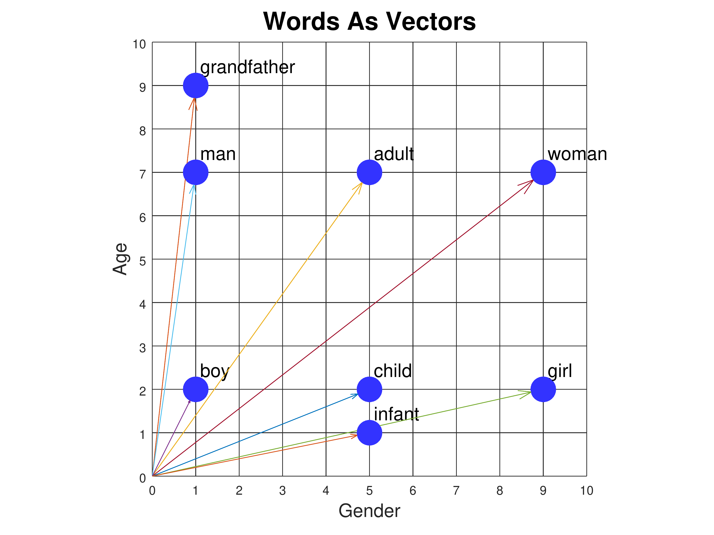

# Embeddings in NLP
[TensorFlow word embeddings](https://www.tensorflow.org/text/guide/word_embeddings)

Approach by which a word is represented by a vector representing its inclination/closeness to certain categories.
Example: 

Source: https://www.cs.cmu.edu/~dst/WordEmbeddingDemo/tutorial.html

