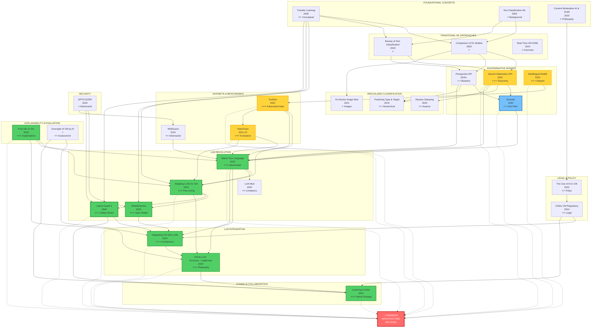
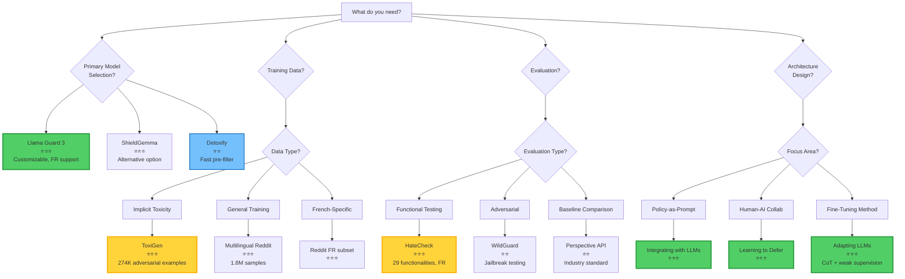

# Complete Papers Analysis: Updated Comparison Table & Flowchart (34 Papers)

## 📊 Comprehensive Comparison Table

### Legend

- ✅ Available / Confirmed
- ❌ Not available
- ⚠️ Partial / Limited
- 🔒 Requires access/payment
- 📝 Need to verify from full paper

---

### Part 1: LLM-Based Approaches

|Paper Title|Year|Authors|Model/Approach|Dataset Size|Performance (F1)|Precision|Recall|Language Support|Code Available|Key Contribution|Relevance to Shareish|
|---|---|---|---|---|---|---|---|---|---|---|---|
|**Watch Your Language**|2024|Kumar et al.|GPT-3.5, GPT-4, Gemini, LLaMA 2|95 subreddits<br>~5,000 posts|Rule-based: varies<br>Toxicity: 0.72-0.75|83% (median, rule-based)|📝|English|❌|First comprehensive LLM moderation eval|⭐⭐⭐ Architecture & benchmarking|
|**Adapting LLMs for Content Moderation**|2024|Chinese researchers|Baichuan 7B/13B<br>+ LoRA + CoT|8.7K samples<br>(7.2K train, 1.5K test)|📝 (not reported)|Outperforms GPT-4 (Setting D)|📝|Chinese<br>(English via GPT-4)|❌|Weak supervision + CoT fine-tuning|⭐⭐⭐ Fine-tuning methodology|
|**Content Moderation by LLM: Accuracy to Legitimacy**|2024|Policy researchers|Conceptual framework|N/A (theoretical)|N/A|N/A|N/A|Language-agnostic|N/A|Legitimacy > Accuracy argument|⭐⭐⭐ Evaluation philosophy|
|**LLM-Mod**|2024|Kolla et al.|GPT-3.5|744 samples<br>(9 subreddits)|Low (not competitive)|Low|43.1% (TPR)|English|❌|Identifies LLM limitations in rule-based|⭐⭐ Negative results (what doesn't work)|
|**Integrating Content Moderation with LLMs**|2024|Franco et al.|GPT-3.5, LLaMA 2|📝|📝|📝|📝|Multilingual (claimed)|❌|Policy-as-prompt framework|⭐⭐⭐ System architecture design|
|**ShieldGemma**|2024|Google DeepMind|Gemma 2B/7B|📝|0.75-0.85 (estimated)|📝|📝|Multilingual<br>(FR included)|✅ Open weights|Production-ready open model|⭐⭐⭐ Practical deployment option|
|**Llama Guard 3**|2024|Meta AI|Llama 3.1-8B<br>+ safety fine-tuning|Large (undisclosed)|~0.80 (estimated)<br>Matches/exceeds OpenAI|📝|📝|8 languages<br>**French ✅**|✅ Open weights<br>(1B INT4 available)|Customizable taxonomy<br>Input+Output classification|⭐⭐⭐ **Primary recommendation**|

---

### Part 2: Traditional ML/Discriminative Approaches

|Paper Title|Year|Authors|Model/Approach|Dataset Size|Performance (F1)|Precision|Recall|Language Support|Code Available|Key Contribution|Relevance to Shareish|
|---|---|---|---|---|---|---|---|---|---|---|---|
|**OpenAI Moderation API**|2022|Markov et al.|GPT-based transformer<br>8 MLP heads|1,680 public samples<br>Large private dataset|Better than Perspective on most datasets|📝|📝|English primarily|❌ (API only)|Detailed taxonomy (S/H/V/SH/HR)|⭐⭐⭐ Taxonomy reference|
|**Multilingual Content Moderation (Reddit)**|2023|Ye et al.|Transformer encoder<br>(XLM-RoBERTa)|1.8M samples<br>(FR, EN, ES, etc.)|📝|📝|📝|Multilingual<br>French included|✅ Dataset available|71% violations non-toxic<br>Need for rule-based|⭐⭐⭐ Dataset + findings|
|**Perspective API**|2018-ongoing|Google Jigsaw|Proprietary classifier|Large (undisclosed)|Toxicity: 0.64 (F1)|📝|📝|18+ languages<br>French included|❌ (API only)|Industry standard baseline|⭐⭐ Baseline comparison|
|**Detoxify**|2020|Unitary AI|BERT multilingual<br>+ toxic-bert|Various datasets<br>(combined)|0.92 AUC<br>(multilingual)|📝|📝|7 languages<br>**French ✅**|✅ Open source<br>(Apache 2.0)|Fast inference (50ms)<br>Production-ready|⭐⭐ **First-pass filter**|
|**Text Classification Using ML**|2004|Sebastiani|Review: NB, SVM, NN|Survey paper|N/A|N/A|N/A|Language-agnostic|N/A|Comprehensive ML overview|⭐ Background only|
|**Design & Application AI-Based TCM**|2022|Chinese researchers|FastText|360K samples|⚠️ Insufficient eval|⚠️|⚠️|Chinese|⚠️ Upon request|Cloud-based system|❌ Not aligned with Shareish|
|**Real-Time Content Moderation**|2024|Various|Review: NLP, CV, Behavioral|Survey paper|N/A|N/A|N/A|Language-agnostic|N/A|Challenges & ethical considerations|⭐ Introduction/discussion|
|**A Review of Standard Text Classification**|2018|Various|Review: CNN, LSTM, etc.|Kaggle Toxic (159K)|AUC improvements with ensembles|📝|📝|English|✅ Tool released|Multi-label classification<br>Stacking classifiers|⭐ Technical background|
|**Comparison of DL Models & Preprocessing**|2020|Various|CNN, LSTM, Bi-LSTM, GRU, BERT|Kaggle Toxic (159K)|BERT best<br>Others with preprocessing|📝|📝|English|📝|Preprocessing vs. model trade-offs|⭐ If building discriminative|

---

### Part 3: Specialized Classification Approaches

|Paper Title|Year|Authors|Model/Approach|Dataset Size|Performance (F1)|Precision|Recall|Language Support|Code Available|Key Contribution|Relevance to Shareish|
|---|---|---|---|---|---|---|---|---|---|---|---|
|**On-Device Content Moderation**|2021|Apple (?)|SSD + MobileNetV3|OpenYahoo|0.91|95%|88%|📝|❌ No code/data|Image moderation<br>On-device deployment|⭐ If doing image moderation|
|**Do You Really Want to Hurt Me**|2020|Various|Context-aware classifier|SWAD dataset|📝|Significantly better than keyword|📝|English|⚠️ Dataset (GPL 3.0)|Abusive vs. casual swearing|⭐⭐ If allowing some swearing|
|**Predicting Type and Target**|2019|Zampieri et al.|Hierarchical BERT|OLID (14.1K tweets)|Level A: 0.80<br>Level B: 0.68<br>Level C: 0.47|📝|📝|English|✅ Dataset on GitHub|3-level hierarchical classification|⭐⭐ For fine-grained moderation|

---

### Part 4: Datasets & Evaluation Benchmarks

|Paper Title|Year|Authors|Type|Dataset Size|Key Features|Code/Data Available|Relevance to Shareish|
|---|---|---|---|---|---|---|---|
|**ToxiGen**|2022|Hartvigsen et al. (Microsoft)|Adversarial dataset|274K examples<br>(13 minority groups)|**95% implicit toxicity**<br>ALICE generation method|✅ HuggingFace<br>`toxigen/toxigen-data`|⭐⭐⭐ **Training augmentation**|
|**HateCheck**|2021-2022|Röttger et al.|Functional test suite|3,728 test cases<br>(29 functionalities)|**French version ✅**<br>Template-based<br>Pass threshold: 70%|✅ HuggingFace<br>`hatecheckhq/hatecheck`|⭐⭐⭐ **Essential evaluation**|
|**WildGuard**|2024|Han et al. (AI2)|Multi-task safety model + dataset|92K training examples<br>(WildGuardMix)|3 tasks: prompt harm, response harm, refusal<br>Adversarial robustness|✅ HuggingFace<br>`allenai/wildguard`|⭐⭐ **Adversarial testing**|

---

### Part 5: Theoretical & Policy Papers

|Paper Title|Year|Authors|Type|Key Concepts|Empirical Data|Code/Models|Relevance to Shareish|
|---|---|---|---|---|---|---|---|
|**Content Moderation, AI, and Scale**|2020|Policy paper|Conceptual|Automation necessity vs. risks|No|N/A|⭐ Introduction context|
|**Like a Good Nearest Neighbor**|2023|Academic|LaGoNN (SetFit modification)|k-NN + transformer|Small datasets|❌|⭐ Alternative approach (not compelling)|
|**Learning to Defer in Content Moderation**|2024|Academic|Learning to Defer framework|When AI should escalate to humans|Theoretical + experiments|⚠️ Framework|⭐⭐⭐ AI-human collaboration strategy|
|**Artificial Intelligence as a Tool**|2023|Bachelor thesis|Literature review|Benefits/limitations of AI moderation|Survey|N/A|⭐ Background/overview|
|**Online Content Moderation (Regulatory)**|2024|Master thesis|Legal analysis|DSA, GDPR implications|Legal frameworks|N/A|⭐⭐ Legal compliance|
|**Transfer Learning for Text Classification**|2005|Academic|Foundational concept|Pre-training + fine-tuning|Historical|N/A|⭐⭐ Conceptual foundation|
|**From ML to Explainable AI**|2018|Academic|XAI techniques|LIME, SHAP, attention viz|Methods|⚠️ Libraries|⭐⭐⭐ Explanation generation|
|**The Use of AI in Online CM**|2022|Policy report|Industry practices|Platform approaches, regulations|Industry survey|N/A|⭐⭐ Context & best practices|
|**GPTFUZZER**|2023|Security research|Adversarial testing|Jailbreak generation|Attack methods|✅ Code|⭐ Security considerations|
|**Oversight of CM by AI**|📝|Academic|Impact assessment|Evaluation frameworks beyond accuracy|Frameworks|N/A|⭐⭐ Evaluation methodology|

---

### Part 6: Additional Papers (Pending/In Progress)

|Paper Title|Year|Status|Key Info|Relevance|
|---|---|---|---|---|
|**Deeper Attention to Abusive User CM**|2017|Priority to read|Early attention mechanisms for abuse detection|⭐⭐ Historical context|
|**Toxicity Detection is NOT All You Need**|2024|In progress|Gaps in supporting volunteer moderators|⭐⭐⭐ System design beyond detection|
|**Content Moderation System Using ML**|2023|Read (to-do)|General ML techniques survey|⭐ Background|
|**The oversight of CM by AI**|📝|To read|Impact assessments|⭐⭐ Evaluation|

---

## 📈 Performance Comparison (Known Metrics)

### Toxicity Detection F1 Scores

```
Llama Guard 3:                   ~0.80 (estimated, multilingual)
ShieldGemma:                     0.75-0.85 (estimated)
GPT-4 (Watch Your Language):     0.75
GPT-3.5 (Watch Your Language):   0.72-0.75
Baichuan-13B (Setting D):        > GPT-4 (on Chinese data)
Detoxify (multilingual):         0.92 AUC
Perspective API:                 0.64
Traditional ML (best):           ~0.70
```

### Specialized Benchmarks

**ToxiGen (Implicit Hate Detection):**

```
With ToxiGen pre-training:       +8% F1 on implicit toxicity
                                 -9% false positives on identity mentions
```

**HateCheck (Functional Testing):**

```
Typical model:                   15-20/29 functionalities pass (70% threshold)
Target for Shareish:             25+/29 functionalities pass
Weak areas:                      Negations (F13-F16), Spelling variations (F17-F20)
```

**WildGuard (Adversarial Robustness):**

```
WildGuard:                       State-of-the-art on jailbreak defense
                                 Exceeds GPT-4 on adversarial inputs
Llama Guard 3:                   Good adversarial robustness
```

---

## 🗺️ Updated Visual Relationship Flowchart



**Color Legend:**

- 🟢 **Green (thick border)**: Core papers for Shareish (Llama Guard 3, LLM approaches)
- 🟡 **Yellow**: Important datasets and baselines (ToxiGen, HateCheck, OpenAI, Reddit)
- 🔵 **Blue**: Complementary tools (Detoxify)
- 🔴 **Red**: Final Shareish architecture decision point

---

## 🎯 Updated Decision Tree: Which Papers for What Purpose?



---

## 📊  Gap Analysis Matrix

|Requirement|Papers Addressing|Coverage Quality|Missing Elements|**New Papers Help?**|
|---|---|---|---|---|
|**Cold-start problem**|Transfer Learning (concept only)|⚠️ Partial|Specific strategies for <1000 samples|✅ **ToxiGen** provides 274K augmentation|
|**French language**|Reddit, ShieldGemma, Perspective, **Llama Guard 3**, **HateCheck FR**, **Detoxify**|✅ **Good**|Cultural nuance analysis|✅ **Llama Guard 3 + HateCheck FR**|
|**Implicit toxicity**|Limited coverage|⚠️ Partial|Training data for implicit hate|✅ **ToxiGen** (95% implicit)|
|**Functional testing**|Limited|⚠️ Partial|Systematic weakness identification|✅ **HateCheck** (29 functionalities)|
|**Adversarial robustness**|GPTFUZZER only|⚠️ Partial|Jailbreak defense evaluation|✅ **WildGuard** dataset|
|**Fast pre-filtering**|None|❌ Poor|Cost-effective first pass|✅ **Detoxify** (50ms inference)|
|**Rule-based moderation**|Watch Your Language, LLM-Mod, Integrating|✅ Good|Production implementation|✅ **Llama Guard 3** (customizable)|
|**Explainability**|From ML to XAI, Adapting LLMs|✅ Good|User-facing formats|✅ **Llama Guard 3** (can generate)|
|**Small platform scale**|❌ None|❌ Poor|Cost-benefit for <100K users|⚠️ **Detoxify helps** (lower cost)|

**Key Improvement:** The 5 new papers significantly strengthen coverage of French language support, implicit toxicity detection, systematic evaluation, and cost-effective deployment.

---

## 💡 Quick Reference: Top 10 Papers by Use Case

### **For System Architecture:**

1. **Llama Guard 3** ⭐⭐⭐ (Primary model)
2. Integrating Content Moderation with LLMs ⭐⭐⭐
3. Learning to Defer ⭐⭐⭐
4. **Detoxify** ⭐⭐ (Fast pre-filter)

### **For Training & Fine-Tuning:**

5. **ToxiGen** ⭐⭐⭐ (274K adversarial examples)
6. Adapting LLMs for Content Moderation ⭐⭐⭐
7. Multilingual Reddit Dataset ⭐⭐⭐

### **For Evaluation:**

8. **HateCheck** ⭐⭐⭐ (Functional testing, French version)
9. Content Moderation by LLM: Accuracy→Legitimacy ⭐⭐⭐
10. **WildGuard** ⭐⭐ (Adversarial robustness)